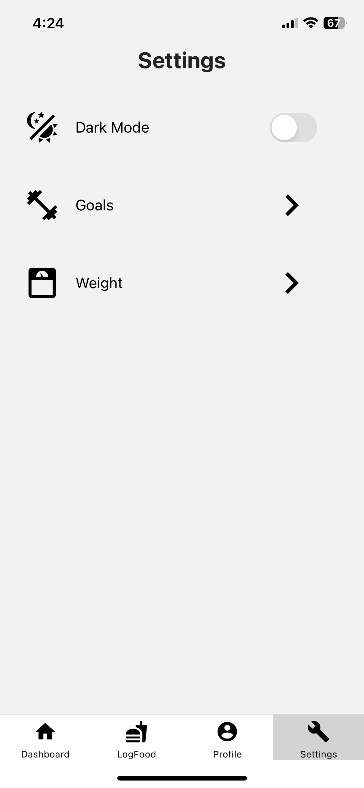

<!-- TABLE OF CONTENTS -->

  
<h2 style="display: inline-block">Table of Contents</h2>

  <ol>
    <li>
      <a href="#about-the-project">About The Project</a>
      <ul>
        <li><a href="#built-with">Built With</a></li>
      </ul>
    </li>
    <li><a href="#contact">Contact</a></li>
  </ol>

<!-- ABOUT THE PROJECT -->
## About The Project

* Food tracking mobile app using React Native to track nutritional values (calories, protein, fat, and carbs)

### Built With

* React Native
* JavaScript
* HTML
* CSS
* Express JS

<!-- CONTACT -->
## Contact

Email: meganle414@gmail.com

Project Link: [https://github.com/meganle414/food-tracker](https://github.com/meganle414/food-tracker)

[linkedin-url]: https://linkedin.com/in/meganle414/
